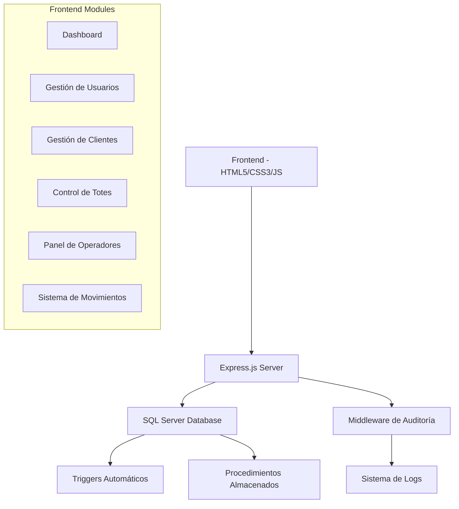

# 📦 DitzlerTotes - Sistema de Gestión Integral

<div align="center">


**Sistema completo de gestión para DitzlerTotes con seguimiento de movimientos en tiempo real**

[](https://nodejs.org/)
[](https://www.microsoft.com/sql-server)
[](https://expressjs.com/)
[]()
[]()

</div>

---

## 🚀 Características Principales

<table>
<tr>
<td width="50%">

### 📱 **Mobile-First**
- Panel optimizado para móviles y tablets
- Interfaz touch-friendly para operadores
- Diseño responsivo en todos los módulos

### 🔍 **Seguimiento en Tiempo Real**
- Log completo de movimientos de totes
- Auditoría automática de todas las operaciones
- Sincronización instantánea entre usuarios

</td>
<td width="50%">

### 🛡️ **Seguridad Avanzada**
- Sistema de roles granular
- Validación de datos en frontend y backend
- Tokens de sesión con expiración automática

### 🔄 **APIs RESTful**
- URLs relativas para túneles públicos
- Endpoints documentados y consistentes
- Integración lista para móviles

</td>
</tr>
</table>

---

## 📋 Tabla de Contenidos

- [🏗️ Arquitectura del Sistema](#️-arquitectura-del-sistema)
- [📁 Estructura del Proyecto](#-estructura-del-proyecto)
- [⚡ Instalación Rápida](#-instalación-rápida)
- [🎯 Funcionalidades](#-funcionalidades)
- [🔌 API Endpoints](#-api-endpoints)
- [📊 Casos de Uso](#-casos-de-uso)
- [🛠️ Configuración Avanzada](#️-configuración-avanzada)
- [🔧 Mantenimiento](#-mantenimiento)

---

## 🏗️ Arquitectura del Sistema



### 🎨 **Frontend**
| Tecnología | Versión | Propósito |
|------------|---------|-----------|
| HTML5 | Latest | Estructura semántica |
| CSS3 | Latest | Estilos con variables personalizadas |
| JavaScript | ES6+ | Lógica modular y reactiva |
| Font Awesome | 6.x | Iconografía profesional |

### ⚙️ **Backend**
| Tecnología | Versión | Propósito |
|------------|---------|-----------|
| Node.js | 14+ | Runtime del servidor |
| Express.js | 5.1.0 | Framework web |
| mssql | 11.0.1 | Driver SQL Server |

### 🗄️ **Base de Datos**
| Componente | Descripción |
|------------|-------------|
| SQL Server 2016+ | Motor principal de base de datos |
| Triggers Automáticos | Sincronización de datos |
| Stored Procedures | Lógica de negocio optimizada |
| Índices Optimizados | Consultas de alto rendimiento |

---

## 📁 Estructura del Proyecto

<details>
<summary><strong>🗂️ Ver estructura completa del proyecto</strong></summary>

```
DitzlerTotes/
├── 📄 index.html                    # Página principal de login
├── 🖥️ server.js                     # Servidor Express con APIs
├── 📦 package.json                  # Dependencias del proyecto
│
├── 🎨 css/                          # Estilos de la aplicación
│   ├── styles.css                   # Estilos globales
│   ├── variables.css                # Variables CSS personalizadas
│   ├── dashboard-styles.css         # Estilos del dashboard
│   ├── operador-totes.css           # Estilos del operador móvil
│   └── unified-table-styles.css     # Estilos unificados de tablas
│
├── ⚡ js/                           # Lógica del frontend
│   ├── config.js                    # Configuración centralizada
│   ├── utils.js                     # Utilidades comunes
│   ├── dashboard.js                 # Lógica del dashboard
│   ├── operador-movements.js        # 🆕 Gestor de movimientos
│   └── [otros módulos...]           
│
├── 📱 pages/                        # Páginas de la aplicación
│   ├── dashboard.html               # Panel principal
│   ├── operador-totes.html          # 🆕 Panel móvil con movimientos
│   ├── admin-users.html             # Gestión de usuarios
│   └── [otras páginas...]
│
├── 🗃️ database/                     # Scripts de base de datos
│   ├── 00_Master_Script.sql         # Script maestro
│   ├── 01_Usuarios_Table.sql        # Tabla de usuarios
│   ├── 02_Clientes_Table.sql        # Tabla de clientes
│   ├── 03_Totes_Table.sql           # Tabla principal de totes
│   ├── 04_Eventos_Table.sql         # Sistema de auditoría
│   └── README.md                    # Documentación de BD
│
└── 🔧 middleware/                   # Middleware personalizado
    └── audit.js                     # Sistema de auditoría
```

</details>

---

## ⚡ Instalación Rápida

### 📋 Requisitos Previos

```bash
✅ Node.js 14+
✅ SQL Server 2016+
✅ SSMS o Azure Data Studio
✅ Permisos de administrador en SQL Server
```

### 🚀 Instalación en 4 Pasos

<details>
<summary><strong>1️⃣ Clonar e Instalar</strong></summary>

```bash
# Clonar repositorio
git clone [url-del-repositorio]
cd DitzlerTotes

# Instalar dependencias
npm install
```

</details>

<details>
<summary><strong>2️⃣ Configurar Base de Datos</strong></summary>

**Opción A: Scripts Separados (Recomendado)**
```sql
-- Ejecutar en orden:
1. database/01_Usuarios_Table.sql
2. database/02_Clientes_Table.sql  
3. database/03_Totes_Table.sql
4. database/04_Eventos_Table.sql
```

**Opción B: Script Maestro**
```sql
-- Ejecutar una sola vez:
database/00_Master_Script.sql
```

</details>

<details>
<summary><strong>3️⃣ Configurar Conexión</strong></summary>

Actualizar credenciales en `server.js`:

```javascript
const sqlConfig = {
  user: 'tu_usuario',           // 👤 Usuario SQL Server
  password: 'tu_contraseña',    // 🔑 Contraseña
  database: 'Ditzler',          // 🗄️ Base de datos
  server: 'localhost',          // 🖥️ Servidor
  port: 1433,                   // 🔌 Puerto
  options: {
    encrypt: false,
    trustServerCertificate: true
  }
};
```

</details>

<details>
<summary><strong>4️⃣ Ejecutar Aplicación</strong></summary>

```bash
# Modo producción
npm start

# Modo desarrollo (con recarga automática)
npm run dev

# Abrir navegador
http://localhost:3002
```

</details>

### 📱 Acceso Móvil (Opcional)

Para dispositivos móviles o acceso externo:

```bash
# Usando Tunnelmole (Recomendado)
npx tunnelmole 3002

# Usando ngrok
ngrok http 3002
```

---

## 🎯 Funcionalidades

### 🔐 Autenticación y Seguridad

<table>
<tr>
<td width="30%"><strong>🎭 Gestión de Roles</strong></td>
<td>Admin, Operador, Viewer, Recepción con permisos granulares</td>
</tr>
<tr>
<td><strong>🔒 Sesiones Seguras</strong></td>
<td>Tokens con expiración automática y validación de estado</td>
</tr>
<tr>
<td><strong>🎨 Personalización</strong></td>
<td>Modo oscuro/claro por usuario</td>
</tr>
<tr>
<td><strong>📊 Auditoría Completa</strong></td>
<td>Registro de eventos de seguridad con IP y timestamps</td>
</tr>
</table>

### 👥 Gestión de Usuarios

- ✅ **CRUD Completo** con validaciones avanzadas
- ✅ **Validación de Email** con función de base de datos `FN_ValidarEmail`
- ✅ **Contraseñas Seguras** con longitud mínima
- ✅ **Estados de Usuario** (Activo, Inactivo, Suspendido)
- ✅ **Auditoría Automática** de todos los cambios

### 🏢 Gestión de Clientes

- 🎯 **Administración Completa** de clientes corporativos
- 🎯 **Categorización** por tipo (Corporativo, PYME)
- 🎯 **Sincronización Automática** con tabla de totes
- 🎯 **Búsqueda Avanzada** con filtros múltiples

### 📦 Control Integral de Totes

<div align="center">

| Estado | Descripción | Color |
|--------|-------------|-------|
| 🟢 Disponible | Listo para uso | Verde |
| 🔵 En Uso | Asignado a cliente | Azul |
| 🟡 En Lavado | Proceso de limpieza | Amarillo |
| 🟠 Con Cliente | En poder del cliente | Naranja |
| 🔴 En Mantenimiento | Requiere reparación | Rojo |
| ⚫ Fuera de Servicio | No disponible | Gris |

</div>

**Características Avanzadas:**
- 📅 **Validación de Fechas** (envasado no futura, vencimiento posterior)
- 🔢 **Códigos Únicos** con validación de duplicados
- ⚠️ **Alertas Automáticas** de vencimiento y mantenimiento
- 🗂️ **Soft Delete** para mantener historial completo
- 📍 **Seguimiento de Ubicación** en tiempo real

### 📊 Sistema de Movimientos de Totes 🆕

> **Novedad:** Sistema completo de seguimiento de movimientos con interfaz en tiempo real

<table>
<tr>
<td width="50%">

**🎯 Tipos de Movimiento:**
- 📥 **Recepción** - Ingreso al sistema
- 🔄 **Reubicación** - Cambio de ubicación  
- ✏️ **Actualización** - Modificación de datos
- 📤 **Desasignación** - Liberación de tote

</td>
<td width="50%">

**💻 Interfaz de Consulta:**
- 📄 Tabla paginada (50 registros/página)
- 🔍 Filtros por usuario, fecha, tipo
- 🔄 Actualización automática (30s)
- 📱 Diseño responsivo para móviles

</td>
</tr>
</table>

### 👷 Panel de Operadores Móvil

<div align="center">

**🎯 Flujos de Trabajo Optimizados**

| Flujo | Descripción | Destino |
|-------|-------------|---------|
| 🔄 **Contenido Reutilizable** | Evaluación en patio | 🏗️ Patio |
| 🧽 **Lavado Directo** | Limpieza inmediata | 🚿 Lavado |

</div>

**Características del Panel:**
- 📱 **Mobile-First Design** - Optimizado para tablets
- 👆 **Touch-Friendly** - Botones grandes e intuitivos
- 📋 **Modales de Proceso** - Guías paso a paso
- 📊 **Log Integrado** - Vista de actividad en tiempo real

---

## 🔌 API Endpoints

### 🔐 Autenticación

| Método | Endpoint | Descripción |
|--------|----------|-------------|
| `POST` | `/api/login` | Iniciar sesión |
| `POST` | `/api/logout` | Cerrar sesión con auditoría |

### 📊 Dashboard y Estadísticas

| Método | Endpoint | Descripción |
|--------|----------|-------------|
| `GET` | `/api/dashboard/stats` | Estadísticas generales |
| `GET` | `/api/operador/stats` | Estadísticas para operadores |

### 👥 Gestión de Usuarios y Clientes

| Método | Endpoint | Descripción |
|--------|----------|-------------|
| `POST` | `/api/admin/users` | Crear/actualizar usuarios |
| `POST` | `/api/admin/clientes` | Crear/actualizar clientes |

### 📦 Gestión de Totes

| Método | Endpoint | Descripción |
|--------|----------|-------------|
| `GET` | `/api/totes` | Obtener listado de totes |
| `GET` | `/api/operador/totes` | Totes para operadores |
| `POST` | `/api/admin/totes` | Crear/actualizar totes |
| `PUT` | `/api/operador/totes/update-status` | Actualizar estado |

### 🆕 Sistema de Movimientos

<details>
<summary><strong>📊 GET /api/movements - Obtener log de movimientos</strong></summary>

**Parámetros de Query:**
- `page` (opcional) - Número de página (default: 1)
- `limit` (opcional) - Registros por página (default: 50)
- `usuario` (opcional) - Filtrar por usuario
- `fecha_inicio` (opcional) - Fecha inicio (YYYY-MM-DD)
- `fecha_fin` (opcional) - Fecha fin (YYYY-MM-DD)

**Headers Requeridos:**
```
Authorization: Bearer [token]
```

**Respuesta de Ejemplo:**
```json
{
  "success": true,
  "data": [
    {
      "fecha_hora": "2024-12-15T10:30:00.000Z",
      "tipo_movimiento": "Recepción",
      "tote_id": "T001",
      "ubicacion_origen": null,
      "ubicacion_destino": "Almacén",
      "usuario": "operador@ditzler.com",
      "estado": "Completado"
    }
  ],
  "pagination": {
    "currentPage": 1,
    "totalPages": 5,
    "totalRecords": 247,
    "limit": 50
  }
}
```

</details>

### 📋 Eventos y Auditoría

| Método | Endpoint | Descripción |
|--------|----------|-------------|
| `GET` | `/api/eventos` | Obtener eventos del sistema |
| `GET` | `/api/eventos/estadisticas` | Estadísticas de eventos |
| `GET` | `/api/eventos/:id` | Detalle de evento específico |

---

## 📊 Casos de Uso

### 1️⃣ Gestión Diaria de Totes

<details>
<summary><strong>👷 Actor: Operador de Totes</strong></summary>

**📱 Flujo Mobile-First:**

1. **🔐 Login** - Iniciar sesión en tablet/móvil
2. **🔍 Selección** - Escanear o buscar tote
3. **⚡ Flujo** - Elegir proceso (Contenido/Lavado)
4. **📋 Seguimiento** - Completar pasos del modal
5. **📍 Confirmación** - Validar ubicación destino
6. **📊 Registro** - Sistema guarda movimiento automáticamente

**🎯 Resultado:** Trazabilidad completa del proceso

</details>

### 2️⃣ Seguimiento de Movimientos

<details>
<summary><strong>👨‍💼 Actor: Supervisor/Administrador</strong></summary>

**📊 Flujo de Análisis:**

1. **🖥️ Acceso** - Panel de operador de totes
2. **👀 Monitoreo** - Log de movimientos en tiempo real
3. **🔍 Filtrado** - Por usuario, fecha, tipo de movimiento
4. **📈 Análisis** - Exportar reportes para análisis
5. **⚡ Optimización** - Identificar patrones y mejorar procesos

**🎯 Resultado:** Insights operacionales y KPIs

</details>

### 3️⃣ Auditoría y Compliance

<details>
<summary><strong>🔍 Actor: Administrador/Auditor</strong></summary>

**📋 Flujo de Auditoría:**

1. **🗂️ Acceso** - Módulo de eventos
2. **🔍 Filtros** - Por fecha, usuario, módulo
3. **📊 Revisión** - Actividades específicas
4. **📄 Exportación** - Logs para cumplimiento normativo
5. **📈 Reportes** - Generar trazabilidad completa

**🎯 Resultado:** Cumplimiento normativo y trazabilidad

</details>

---

## 🛠️ Configuración Avanzada

### 🔧 Variables de Entorno

<details>
<summary><strong>⚙️ Configuración del Sistema</strong></summary>

```javascript
// config.js - Configuración centralizada
const CONFIG = {
  SESSION: {
    STORAGE_KEY: 'userData',
    TIMEOUT: 30 * 60 * 1000, // 30 minutos
  },
  API: {
    BASE_URL: '', // URLs relativas para túneles
    TIMEOUT: 10000,
  },
  UI: {
    ITEMS_PER_PAGE: 50,
    REFRESH_INTERVAL: 30000, // 30 segundos
  }
};
```

</details>

### 📡 Configuración de Túneles

<table>
<tr>
<td width="50%">

**🔗 Tunnelmole (Recomendado)**
```bash
npx tunnelmole 3002
```
- ✅ Gratuito y confiable
- ✅ HTTPS automático
- ✅ URLs estables

</td>
<td width="50%">

**🌐 ngrok**
```bash
ngrok http 3002
```
- ✅ Popular y robusto
- ✅ Análisis de tráfico
- ⚠️ Requiere cuenta para persistencia

</td>
</tr>
</table>

### 🗄️ Optimización de Base de Datos

<details>
<summary><strong>📈 Scripts de Optimización</strong></summary>

```sql
-- 🧹 Limpieza de logs antiguos (ejecutar mensualmente)
EXEC SP_LimpiarEventosAntiguos @diasAntiguedad = 90;

-- 📊 Estadísticas del sistema
EXEC SP_EstadisticasDashboard;

-- 🔍 Verificar integridad
DBCC CHECKDB('Ditzler');

-- 📈 Actualizar estadísticas
UPDATE STATISTICS Totes;
UPDATE STATISTICS AuditoriaGeneral;
```

</details>

---

## 🔧 Mantenimiento

### 📅 Tareas Regulares

<div align="center">

| Frecuencia | Tarea | Comando |
|------------|-------|---------|
| 🔄 **Diario** | Backup Completo | `BACKUP DATABASE Ditzler...` |
| ⏰ **6 Horas** | Backup Diferencial | `BACKUP DATABASE ... DIFFERENTIAL` |
| 📅 **Semanal** | Verificar Índices | `DBCC CHECKDB('Ditzler')` |
| 🗓️ **Mensual** | Limpiar Logs | `EXEC SP_LimpiarEventosAntiguos` |

</div>

### 📊 Monitoreo de Rendimiento

<details>
<summary><strong>🔍 Métricas Clave</strong></summary>

**🖥️ Servidor:**
- CPU y memoria del servidor Node.js
- Tiempo de respuesta de APIs (<200ms)
- Conexiones concurrentes a base de datos

**🗄️ Base de Datos:**
- Fragmentación de índices (<30%)
- Crecimiento de logs de transacciones
- Estadísticas de consultas lentas

**👥 Usuarios:**
- Sesiones activas simultáneas
- Patrones de uso por rol
- Errores de autenticación

</details>

### 🚀 Actualizaciones

```bash
# 📦 Actualizar dependencias
npm update

# 🔍 Verificar vulnerabilidades
npm audit

# 🛠️ Aplicar parches de seguridad
npm audit fix
```

---

## 📞 Soporte y Contacto

<div align="center">

### 🆘 ¿Necesitas Ayuda?

| Tipo de Consulta | Método de Contacto |
|------------------|-------------------|
| 🐛 **Bugs y Errores** | Crear issue en repositorio |
| 💡 **Nuevas Funcionalidades** | Solicitud de features |
| 🔧 **Configuración** | Documentación técnica |
| 🚨 **Emergencias** | Contacto directo |

</div>

---

## 📄 Información del Proyecto

<div align="center">

**🏢 Sistema de Gestión de Totes - Ditzler**

📊 **Versión del Sistema:** `1.2.0`  
📅 **Última Actualización:** Diciembre 2024  
🆕 **Incluye:** Sistema de Movimientos y Auditoría Avanzada

---

<sub>© 2024 Ditzler. Todos los derechos reservados.</sub>

</div>

### 🔑 Credenciales por Defecto

> ⚠️ **IMPORTANTE:** Cambiar en producción

```
👤 Usuario Administrador:
   📧 Email: admin@ditzler.com
   🔑 Contraseña: admin123
   🛡️ Permisos: Acceso completo al sistema
```

---

<div align="center">

**¿Te gusta el proyecto? ⭐ Dale una estrella!**

[🏠 Inicio](#-ditzlertotes---sistema-de-gestión-integral) • [📋 Instalación](#-instalación-rápida) • [🔌 API](#-api-endpoints) • [🔧 Configuración](#️-configuración-avanzada)

</div>